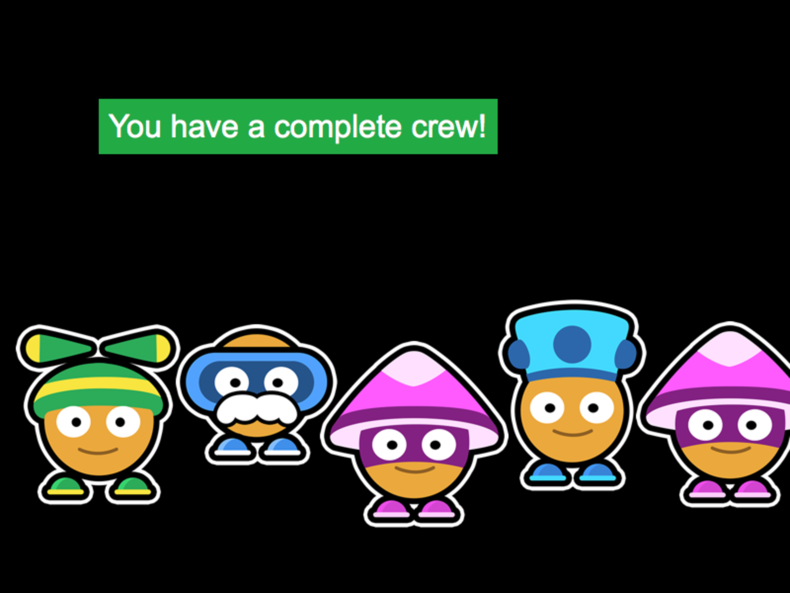

# Demo DApp

Check out our running example [here](https://example-dapp-1.bitski.com/)



## Running Locally

First, install the dependencies.

```bash
npm install
```

Next, you'll need to use Truffle to deploy the contracts on one of Bitski's supported networks (Kovan or Rinkeby).

Install a local Ethereum node (Parity, or Geth), and configure your `truffle.js` to point at it, and run:

```bash
truffle migrate
```

Once the contracts are deployed, you can run to start the development server. You can learn more about deploying contracts with truffle [here](http://truffleframework.com/docs/getting_started/migrations).

```bash
npm run dev
```

Then browse to [http://localhost:3000](http://localhost:3000)

## Contract

The backend of our app will run as a contract on Ethereum. The code of this contract is located in [contracts](contracts/).

## Game

The front end of our app will run as a game using the Phaser framework. The code is located in [app](app/) and the assets are located in ```assets```.
