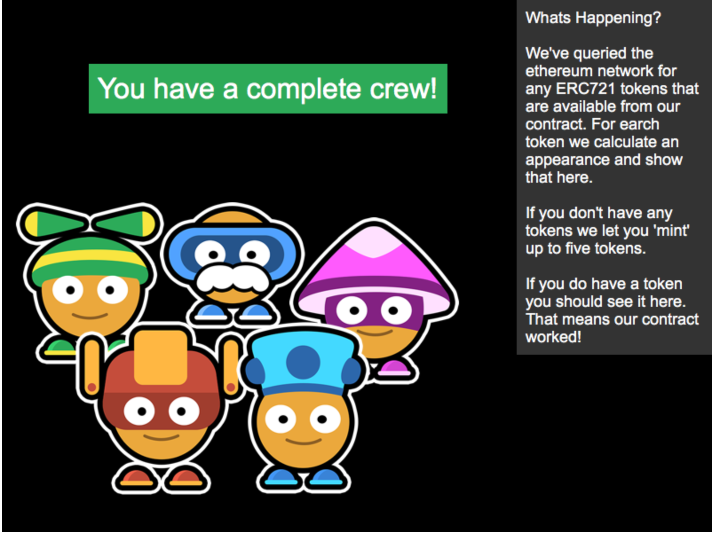

# Demo DApp

Check out our running example [here](https://example-dapp-1.bitski.com/)



## Running Locally

First, install the dependencies.

```bash
npm install
```

Next, you'll need to use Truffle to deploy the contract. We'll start by running the contract on a local blockchain. Start by installing truffle globally.

```bash
npm install -g truffle
```

Then, start truffle's development blockchain

```bash
truffle develop
```

Once the development blockchain is running, then run the migrations in the dev console:

```bash
truffle(develop)> migrate
```

You can learn more about deploying contracts with truffle [here](http://truffleframework.com/docs/getting_started/migrations).

Once the contracts are deployed, you can start the development server. Make sure to run the dev server in another terminal.

```bash
npm run dev
```

Then browse to [http://localhost:3000](http://localhost:3000) to interact with the app.

## Deploying to a real network

Once you have your dapp how you want it, you'll want to deploy it to a live blockchain somewhere. This can be achieved using a local Ethereum node, or Bitski's app wallet feature.
To use Bitski's app wallet, you'll need to request access to this feature. Once you have an app wallet, find the client id and secret.

Modify your `truffle.js` to look like `truffle.example.js`, filling in the client id and secret. Make sure not to expose these keys anywhere as they give access to your wallet.

Next, you'll want to build the app with webpack, and migrate your contracts to the network you desire:

```bash
# mainnet
npm run build

# build for kovan. see package.json for more options
npm run build-kovan
```

## Client ID

If you want to deploy your version of this dapp somewhere, you'll need to create a Bitski app, and enter the client id in `webpack.config.js` under `BITSKI_CLIENT_ID`. Note that this is **not** the same as your app wallet client id.

## Modifying the Contract

The backend of our dapp is a contract on Ethereum. The code of this contract is located in [contracts](contracts/).

## Game

The front end of our app is a game using the Phaser framework. The code is located in [app](app/) and the assets are located in ```assets```.
